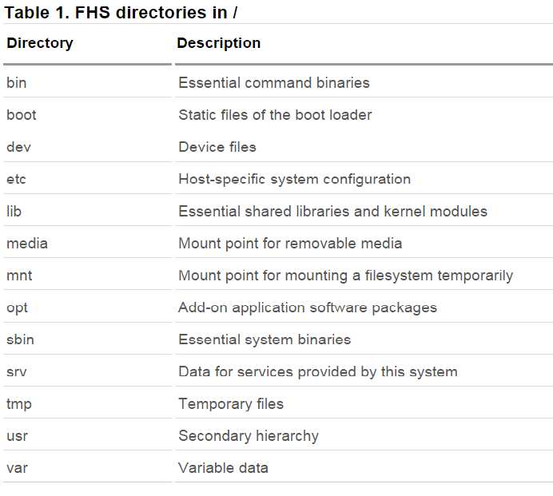
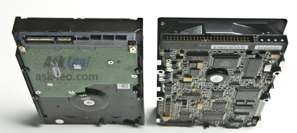
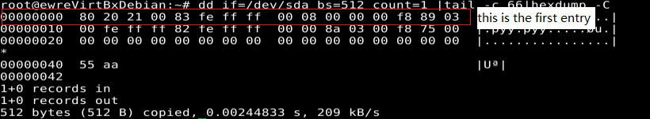
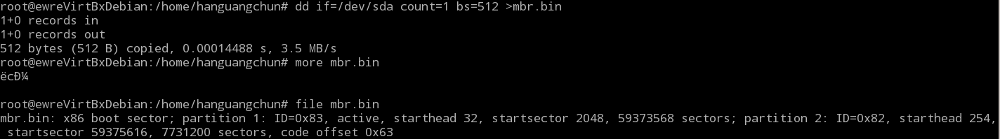
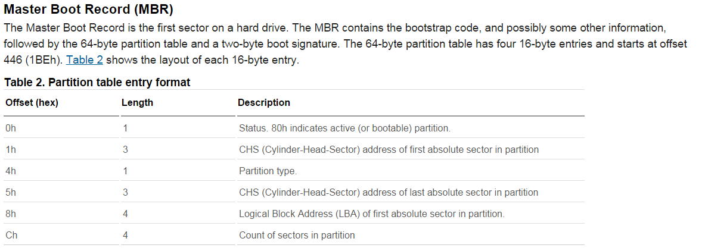
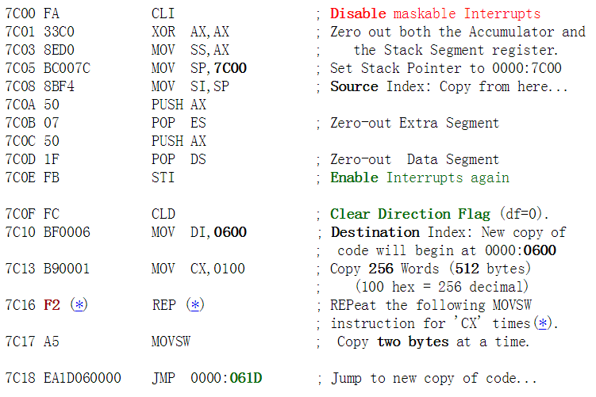
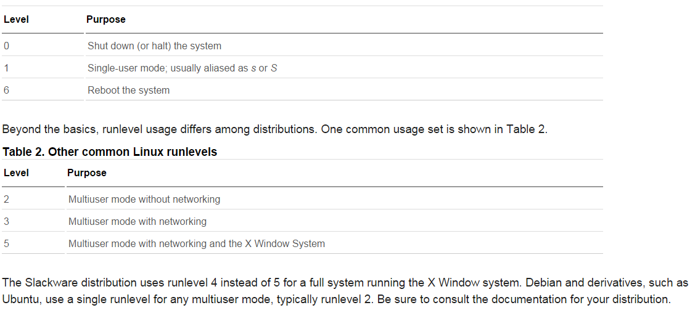
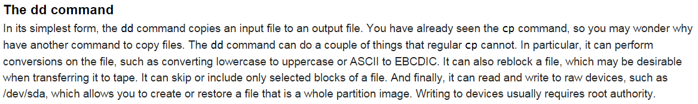

# hard disk layout 
* directories requited in / defined by Filesystem Hierachy  
Standard(FSH)   
* scsi devices and ide devices  
  * scsi(pronouced scuzzy), is a interface standard used by computers to attching peripheral devices to computers, usually used on server or high-end machine which requires high availablility and durability, it is expensive.  
  * ide( also known as ATA), a disk drive implementation that integrates the controller on disk driver itself, used on low-end pcs, it's more cost effective compared with scsi  
  * sata: seriel ATA, the successor of ATA who comes with faster speed and low price  
  * pata: parallele ATA, another kind of ATA which has gradually been disappeared    
  * about hard disk  
    * the structure of a typical hard disk   
        
    * disk geometry   
	  "Units = " line in the picture above shows the total bytes in a unit you have been set(with command 'u') in parted or fdisk software  
     * how to get the MBR?  
       * the MBR(master boot record, totally 512 byte which = 446 + 64 + 2) scheme:  
     	  * 446 byte - bootstrap code  
		  * 64 byte - partition table  
		  * 2 byte - signature  
       * to get the MBR:  
       	 dd if=/dev/sda bs=512 count=1 >place_where_dumped_mbr_goesto  
       * to get the paritaion table&signature(the end 66 byte of the mbr):  
      	 dd if=/dev/sda bs=512 count=1 | tail -c 66 | hexdump -C  
	    
       * from here we know that the __file__ command of linux is very
         useful:   
      * meaning of the partation table  
        
    * about the booting code in MBR
	well, I am unable to understand the MBR boot code dumped from my
	virtualbox debian linux, but
	[here](http://thestarman.narod.ru/asm/mbr/STDMBR.htm) is an
	explanation of the booting code in a typical MBR generated by
	fdish /MBR dos utility.
		* briefly, the code can be divided into parts:
		  * first move itself from memory at 7C00 to memory at 6C00;
		  __
		  * search for the __active__ partitaion.   
		  * copy the boot code on the active partition into memory at 7C00 and jump to
            that code to execute.

# boot the system  
* stage 1 boot loader: executable codes that resides in the fisrt
sector of (the __MBR__) of every disk(floppy, CD, DVD, usd disk etc)  
* chain loading: when a boot manager tries to load another boot
manager   
* the init process  
* dmsg for kernel massages  
* /var/log/messages for process related massages
  deamon processes: processes run in background to response to some
  event or condiction  

# run levels, shutdown and reboot  
* runlevels:   
* to change runlevel permanately: edit /etc/inittab  
* to re-change runlevel after boot: runlevel ; telinit N  
* systemd and upstart: new alternatives to init  

# manage shared libraries  
* static or dynamic linking  
sln: a static linking version of ln  
* lib64 dir: shared libraries for 64-bit programms on a 64-bit system  
* ldd: a command to check whether an executeble programm is  
dynamically linked and which dynamic libraries it needs  
* XXX.so: shared objects or, dynamically linked libraries  
*dynamic loading  
 ld-linux.so itself is the executable to determine the dynamic loading.
 ld.so.conf tells ld-linux.so where to find xxx.sos
 ldconfig caches the results  

# debian package management system:apt-get  
* to remove unused dependencies:apt-get autoclean  
* to reconfigure packages: dpkg-reconfigure xxx  
* finding debian packages: apt-cache search "xxxx"  

# rpm and yum  
* yum install, remove, search  

# the linux commanline  
* uname: system information printing  
* man: manual page  
# text streames  
* od: octal dump  

# file and directory management  
* what is touch?: touch updates the modification time of the files, if
given no parameters, touch will create a new file if the the filename
does not exists.  
* find command: find by various ways: find -name -type -size -mtime  
* file: to get the information of the file type(txt, jpg or others)  
* file compressing: gzip, bzip2  
* file archiving:   
  tar(tape archive)
  cpio
  dd   

#create monitoring and kill processes  
* run a process after log out  
  SIGHUP will cause the process to close  
  nohup xxx will make the process running after logout  
 * monitoring process:  
 ps(process status)
 job

